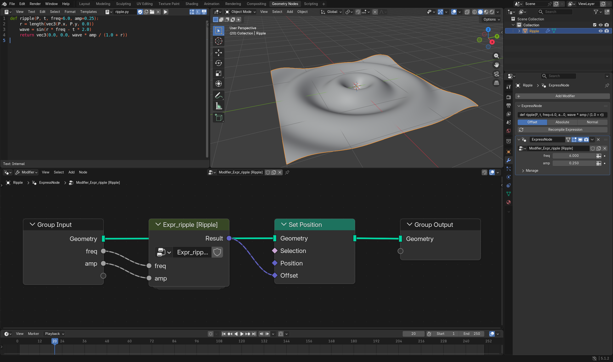

# ExpressNode

**Type a maths expression, get a clean Geometry Nodes tree.**

ExpressNode is a Blender extension for people who use Geometry Nodes and would rather write
`sin(r * freq - t) * amp` than wire up twenty Math nodes. You type a short Python-style function;
ExpressNode compiles it into a native, readable Geometry Nodes node group, with your function's
parameters as inputs. The result is ordinary Geometry Nodes: it renders in Cycles and EEVEE,
works from the command line, and opens in Blender without the extension installed.



*Left: the expression. Top: the ripple it makes on a grid. Bottom: the generated tree, one
`Expr_ripple` group with `freq` and `amp` as inputs. Right: the ExpressNode modifier panel.*

## Install

1. Download `expressnode-<version>.zip` from the
   [Releases](https://github.com/quacktheplanet/ExpressNode/releases) page, or build it yourself with
   `python tools/package_addon.py dist`.
2. In Blender 5.0 or newer: **Edit › Preferences › Get Extensions › ⌄ › Install from Disk**, then
   pick the zip.

## Quick start

### As a modifier

1. Select a mesh with some resolution (for example a Grid with 100 × 100 subdivisions).
2. **Properties › Modifiers › ExpressNode**: paste an expression and click **Recompile Expression**.
3. Choose how the result is applied: **Offset** moves each point by the result, **Absolute** places
   it there, and **Normal** pushes it along its normal by a number.

```python
def ripple(P, t, freq=6.0, amp=0.25):
    r = length(vec3(P.x, P.y, 0.0))
    wave = sin(r * freq - t * 2.0)
    return vec3(0.0, 0.0, wave * amp / (1.0 + r))
```

Play the timeline and the grid ripples outwards. `freq` and `amp` appear on the modifier, where you
can tweak or animate them. Recompiling keeps the values you've tuned.

### As a node group in your own tree

1. Open a Geometry Nodes editor and press **N** for the sidebar: **ExpressNode** tab.
2. Type an expression and click **Add Expression Node Group**. A group node drops into your tree,
   with an input for each parameter and a **Result** output to wire into anything.
3. To change it later, select the group, edit the text and click **Update Selected Group**. Every
   copy of that group updates, and its links stay connected.

## The expression language, in brief

- **A function** `def name(P, t, a=1.0, b=2.0): ...`. Parameters with defaults become inputs. The
  body can use assignments, `if` / `else`, and helper functions you define, which become nested
  groups.
- **Built-in inputs:** `P` (position), `N` (normal), `i` (index), `t` (time in seconds), `frame`,
  `dt`.
- **Maths:** `sin cos tan asin acos atan atan2 sqrt pow exp log abs sign floor ceil round fract mod
  min max clamp mix step smoothstep ping_pong`.
- **Vectors:** `vec2 vec3 vec4 length distance dot cross normalize reflect`, and `.x .y .z`.
- **Noise:** `noise` and `voronoi`, which are Blender's own.
- **Attributes and objects:** `attr('name')`, `set_attr('name', value)`, `obj('Name', 'field')`.

Unsupported Python (strings in maths, lambdas, imports and so on) gives a clear error that points at
the line and column. The full list is in
[docs/expression-reference.md](docs/expression-reference.md), and worked examples are in
[docs/examples/](docs/examples/).

## One expression, four outputs

The same parsed expression can be compiled to several targets:

| Target | What it's for |
|---|---|
| **Geometry Nodes** | The main output: native node groups, as above. |
| **OSL** | A Cycles shader, for the same maths as a texture or volume at render time. |
| **GLSL** | Blender's GPU module, for real-time preview and viewport drawing. |
| **WGSL** | WebGPU compute, for running the maths in a browser over millions of points. |

All four are checked against a reference evaluator written in numpy, so they agree with each other.
From Python:

```python
import expressnode
src = open("examples/ripple.py").read()
expressnode.osl_source(src)      # Cycles OSL
expressnode.glsl_source(src)     # GLSL
expressnode.wgsl_source(src)     # WGSL
```

ExpressNode also powers **Bake to Nodes** in [CodeNodes](https://github.com/quacktheplanet/CodeNodes),
which turns GPU code into native Geometry Nodes. Other add-ons can use it the same way:
`import expressnode`.

## Upgrading from Coding Nodes / Expression Nodes

ExpressNode used to be called Coding Nodes. Files made with the old add-on still open and render,
because the generated trees are plain Geometry Nodes. When ExpressNode loads such a file, it moves
the old add-on's settings to the new names: each object's expression, apply mode and modifier name,
the scene's group expression, and the generated groups' markers. Install ExpressNode, then remove
the old add-on.

## Testing

```bash
python -m pytest tests -q                        # ~300 tests, no Blender needed
python tests/blender/run_all.py --blender <path/to/blender> [--blender ...] \
    [--puppeteer <dir with node_modules/puppeteer-core>]
```

The second command runs the checks inside each Blender you give it: Geometry Nodes against the
reference, OSL rendered in Cycles, GLSL on the GPU module, installing the extension zip, and old-file
migration. With `--puppeteer` it also checks WGSL in a browser. Release checks cover Blender 5.0.1,
5.1.2 and 5.2.2. See [TESTING.md](TESTING.md).

## More

- [docs/](docs/): the expression reference, the compiler's design (grouping, emission, evaluator,
  OSL, GLSL, WGSL) and a comparison with other tools.
- [docs/design/](docs/design/): the original scope, spec and build plan.
- [docs/HISTORY.md](docs/HISTORY.md): how it was built and verified.

## Licence

GPL-3.0-or-later, like Blender itself: see [LICENSE](LICENSE).
